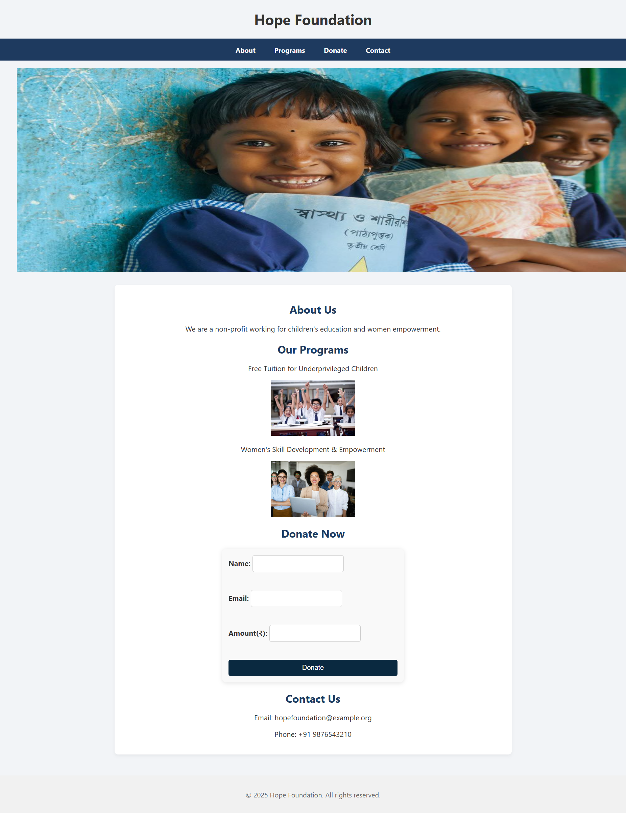

# 🌟 Hope Foundation – NGO Website for Donation & Awareness

This is a simple and responsive website built for *Hope Foundation*, a Non-Governmental Organization focused on raising awareness and collecting donations for various social causes.

---

## 🧾 Project Overview

This project is developed using *HTML and CSS*. It showcases the NGO’s mission, encourages donations, and spreads awareness about ongoing issues and campaigns.

---

## 🌐 Website Sections

- *Home Page:* Introduction to the NGO and its mission
- *Awareness Section:* Information about causes supported by the NGO
- *Donation Section:* Encourages users to support via donations (UI only)
- *Contact Form:* For users to get in touch
- *Responsive Design:* Mobile and desktop friendly

---

## 📁 Folder Structure
📦 Responsive-Ngo-Website/
├── index.html
├── style.css
├── images/
│   ├── classroom.jpg
│   ├── women.jpg
│   ├── image1.jpg
│   ├── image2.jpg
│   ├── image3.jpg
│   ├── image4.jpg
│   └── image5.jpg

---

## 🛠 Technologies Used

- *HTML5*
- *CSS3*

---

## 🔍 Website Preview



---

## 🚀 How to Use

1. Clone the repository:
   ```bash
   git clone https://github.com/SakshiParalekar/Responsive-Ngo-Website.git

---

## ❤ Thank You

Thank you for checking out this project! Feel free to star the repo if you found it helpful.
